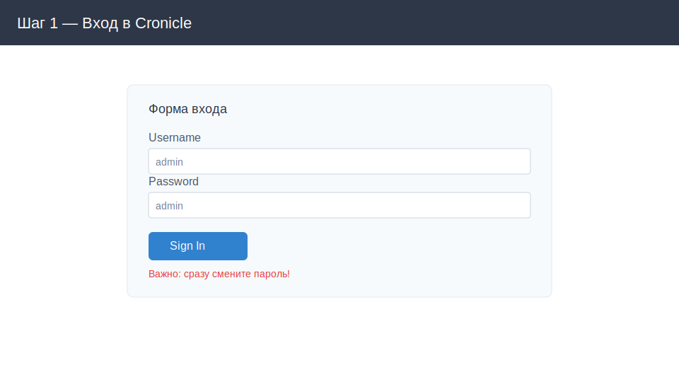
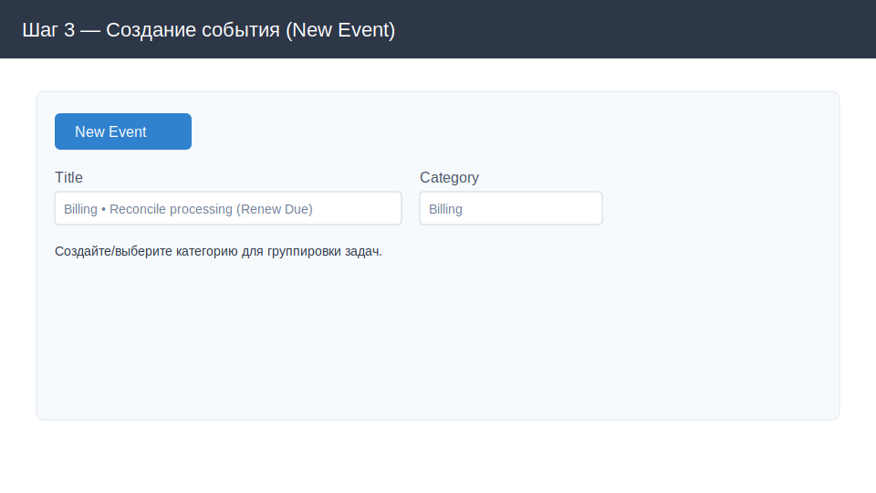
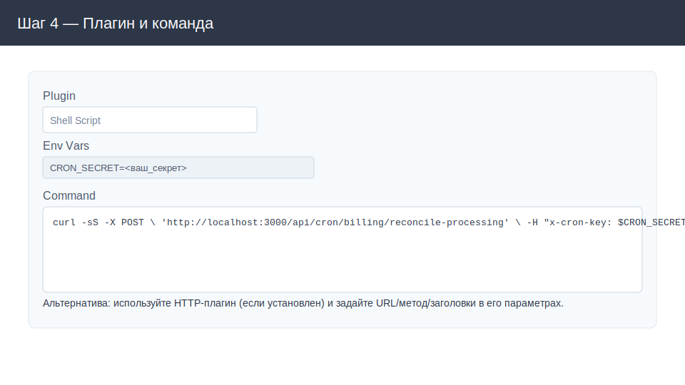
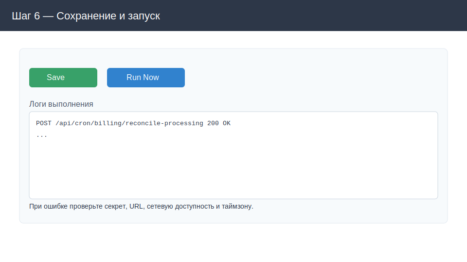

# crone-service

Важное замечание: сразу после запуска замените пароль администратора. По умолчанию логин/пароль: `admin` / `admin`.

Ниже — пошаговая инструкция с картинками, как в UI Cronicle создать джобу, которая каждые 5 минут делает POST-запрос для добивания «зависших» платежей через API провайдера.

## Что настраиваем
- URL: `http://localhost:3000/api/cron/billing/reconcile-processing`
- Method: `POST`
- Headers:
  - `x-cron-key: <CRON_SECRET>`
  - `Content-Type: application/json`
- CRON: `2-59/5 * * * *` (каждые 5 минут: 02, 07, 12, 17, 22, 27, 32, 37, 42, 47, 52, 57)
- Назначение: добивать «зависшие» платежи через API провайдера (Renew Due)

Примечание про время: контейнер Cronicle в `docker-compose` настроен на часовой пояс `Europe/Moscow`. Если ваш часовой пояс другой, скорректируйте `TZ` в `app/docker-compose.yaml`.

---

## Шаг 1. Откройте UI и войдите
Откройте `http://localhost:3012/` в браузере и войдите под администратором.



Логин: `admin`, Пароль: `admin` (по умолчанию). Сразу перейдите к смене пароля (следующий шаг).

## Шаг 2. Смените пароль администратора
Откройте: Admin → Users → `admin` → Change Password. Введите новый сложный пароль и сохраните.


## Шаг 3. Создайте новое событие (джобу)
Перейдите в раздел событий и нажмите «New Event».

Задайте:
- Title: `Billing • Reconcile processing (Renew Due)`
- Category: `Billing` (создайте, если её ещё нет)



## Шаг 4. Укажите плагин и команду
Проще всего использовать плагин `Shell Script` и выполнить `curl` с нужными заголовками. Чтобы не хранить секрет в явном виде в команде, сохраните его как переменную окружения у события.

В блоке Env Vars добавьте:
- `CRON_SECRET=<ваш_секрет>`

В поле Command вставьте команду:

```
curl -sS -X POST \
  'http://localhost:3000/api/cron/billing/reconcile-processing' \
  -H "x-cron-key: $CRON_SECRET" \
  -H 'Content-Type: application/json' \
  --data '{}' \
  --fail --show-error
```



Если у вас установлен специализированный плагин для HTTP-запросов (например, `http-post.sh`), можно использовать его и задать URL/метод/заголовки в параметрах плагина.

## Шаг 5. Настройте расписание (CRON)
В поле расписания укажите:

```
2-59/5 * * * *
```

Это время запуска «каждые 5 минут» в минуты 02, 07, 12, 17, 22, 27, 32, 37, 42, 47, 52, 57 в вашем часовом поясе контейнера.


Рекомендации в «параметрах выполнения» (по желанию):
- Max Concurrent: `1` (не запускать параллели)
- Timeout: `60–120s` (в зависимости от API)
- Retries: `1–3`
- Catch Up / Missed runs: включить, если хотите «догонять» пропущенные запуски (аналог «Renew Due» поведения при простоях)

## Шаг 6. Сохраните и выполните пробный запуск
Сохраните событие и выполните «Run Now» для проверки. Перейдите в лог выполнения, чтобы убедиться, что запрос отработал без ошибок (код 2xx, ожидаемый ответ).



---

## Отладка
- 401/403: проверьте заголовок `x-cron-key` и значение `CRON_SECRET`.
- 404: проверьте URL и маршрут в вашем сервисе.
- Connection refused/ECONNREFUSED: убедитесь, что приложение доступно на `localhost:3000` и не блокируется фаерволом/сетью.
- Таймзона: если расписание «съезжает», проверьте `TZ` в `app/docker-compose.yaml`.
- Повторные попытки: увеличьте `Retries` и/или `Timeout` при периодических сбоях у провайдера.

## Полезно знать
- UI Cronicle доступен по `http://localhost:3012/` (см. `app/docker-compose.yaml`).
- Логи Cronicle сохраняются в тома `./logs` (см. compose-файл). Сами логи выполнения задач также доступны через UI.
